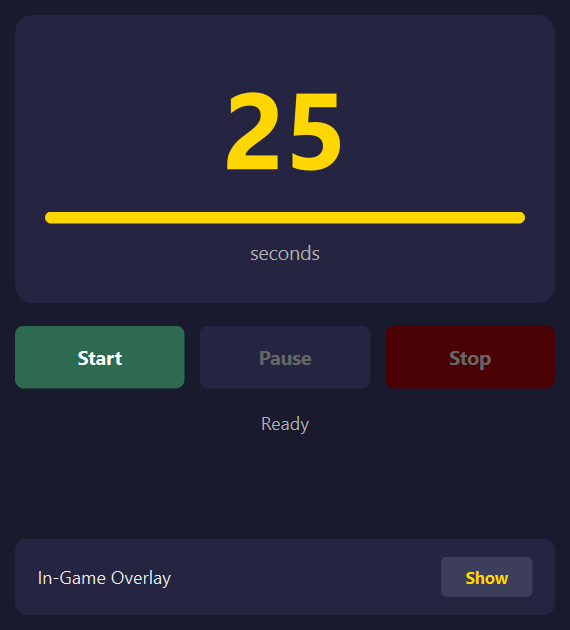
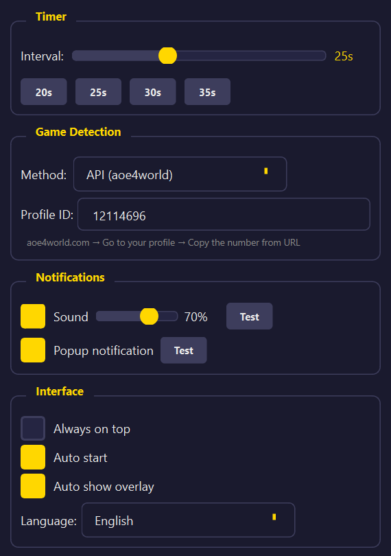
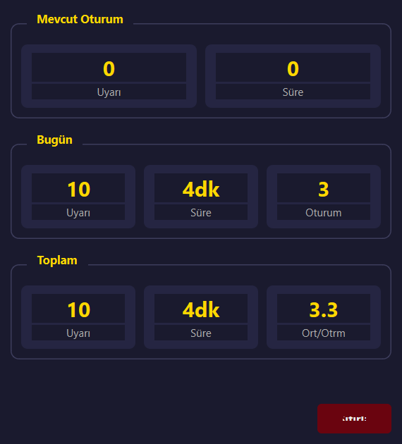
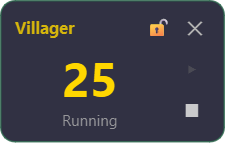

# 🏰 AoE4 Villager Reminder

<div align="center">

**Never forget to produce villagers in Age of Empires 4 again!**

A lightweight desktop companion app that reminds you to keep your Town Center busy.

[](https://python.org)
[](https://riverbankcomputing.com/software/pyqt/)
[](LICENSE)
[]()

</div>

---

> ⚠️ **Disclaimer**
> 
> This application is a **standalone training/habit-building tool** that runs completely independently from Age of Empires 4. It does **NOT**:
> - Read, modify, or interact with game files or memory
> - Inject code or hook into the game process
> - Provide any in-game advantage or automation
> - Violate the game's Terms of Service
> 
> It simply acts as an external timer/reminder to help you develop the habit of continuously producing villagers. The optional API integration only reads your **public** match history from [AoE4World](https://aoe4world.com) to detect when a game starts — no private data is accessed.

---

## ✨ Features

### 🎮 Smart Game Detection
- **API Mode**: Automatically detects when you start a match via [AoE4World](https://aoe4world.com) API
- **Manual Mode**: Full control - start and stop the timer yourself

### ⏱️ Customizable Timer
- Adjustable interval from 5 to 60 seconds
- Quick preset buttons (20s, 25s, 30s, 35s)
- Visual countdown with progress bar
- Color changes when timer is low (≤3 seconds)

### 🔔 Multi-Modal Notifications
- **Sound Alerts**: Customizable volume with test button
- **Popup Notifications**: Windows toast notifications
- Enable/disable each notification type independently

### 🎯 In-Game Overlay
- Transparent, always-on-top mini window
- Draggable and lockable position
- Auto-show when match starts
- Minimal footprint - doesn't interfere with gameplay

### 📊 Statistics Tracking
- Session alerts and duration
- Daily statistics
- All-time totals and averages
- Reset functionality

### 🌍 Multi-Language Support
- English 🇬🇧
- Türkçe 🇹🇷
- Deutsch 🇩🇪
- Español 🇪🇸
- Français 🇫🇷

### 🖥️ System Tray Integration
- Minimize to system tray
- Quick access menu
- Runs quietly in background

---

## 📸 Screenshots

<div align="center">

### Timer Panel
*Main countdown display with start/pause/stop controls*



### Settings Panel
*Configure detection mode, notifications, and preferences*



### Statistics Panel
*Track your session, daily, and all-time stats*



### In-Game Overlay
*Transparent, always-on-top mini timer visible during gameplay*



</div>

---

## 🚀 Installation

### Option 1: Download Release (Recommended)

1. Go to [Releases](https://github.com/yourusername/aoe4-villager-reminder/releases)
2. Download `AoE4VillagerReminder.exe`
3. Run the executable - no installation required!

### Option 2: Run from Source

**Requirements:**
- Python 3.11 or higher
- Windows 10/11

```bash
# Clone the repository
git clone https://github.com/yourusername/aoe4-villager-reminder.git
cd aoe4-villager-reminder

# Install dependencies
pip install -r requirements.txt

# Run the application
python main.py
```

---

## 📖 Usage Guide

### Game Detection Modes

| Mode | Description | Best For |
|------|-------------|----------|
| **API** | Uses AoE4World API to detect matches | Players with public profiles |
| **Manual** | You control when timer starts/stops | Private profiles, custom games |

### Setting Up API Mode

1. Go to [aoe4world.com](https://aoe4world.com)
2. Search for your profile
3. Copy the **Profile ID** from the URL (e.g., `https://aoe4world.com/players/12345678` → `12345678`)
4. Paste it in Settings → Profile ID field

### Using the Overlay

1. Click **"Show"** in the Timer tab, or enable **"Auto show overlay"** in Settings
2. The overlay appears in the top-right corner
3. **Drag** to reposition (when unlocked)
4. **Lock** 🔒 to prevent accidental moves
5. **Close** ✕ to hide (timer continues running)

### Keyboard Workflow

The app is designed to stay out of your way:
1. Start a match → Timer auto-starts (API mode)
2. Play the game with overlay visible
3. Hear sound + see flash every 25 seconds
4. Never idle your TC again!

---

## ⚙️ Configuration

Settings are saved automatically to `config.json`:

| Setting | Default | Description |
|---------|---------|-------------|
| Interval | 25s | Time between reminders |
| Volume | 70% | Alert sound volume |
| Sound | ✅ | Enable sound alerts |
| Popup | ❌ | Enable Windows notifications |
| Always on Top | ❌ | Keep main window above others |
| Auto Start | ✅ | Start timer when game detected |
| Auto Overlay | ✅ | Show overlay when game starts |

---

## 🔧 Building from Source

### Create Standalone Executable

```bash
# Install PyInstaller (included in requirements.txt)
pip install pyinstaller

# Build the executable
pyinstaller --name="AoE4VillagerReminder" --windowed --onefile --add-data="assets;assets" main.py
```

The executable will be created in the `dist/` folder.

### Running Tests

```bash
# Install test dependencies
pip install pytest pytest-qt

# Run all tests
pytest tests/ -v

# Generate golden images
python tests/test_golden.py
```

---

## 📁 Project Structure

```
aoe4-villager-reminder/
├── main.py                 # Application entry point
├── requirements.txt        # Python dependencies
├── assets/
│   ├── icons/             # Application icons
│   └── sounds/            # Alert sound files
├── src/
│   ├── locales/           # Translation files (JSON)
│   ├── services/
│   │   ├── game_detector.py    # API/manual game detection
│   │   ├── notification.py     # Sound & popup alerts
│   │   ├── stats_tracker.py    # Statistics management
│   │   └── timer_service.py    # Countdown timer logic
│   ├── ui/
│   │   ├── main_window.py      # Main application window
│   │   ├── timer_panel.py      # Timer display & controls
│   │   ├── settings_panel.py   # Configuration UI
│   │   ├── statistics_panel.py # Stats display
│   │   ├── overlay_widget.py   # In-game overlay
│   │   └── styles.py           # Dark theme styles
│   └── utils/
│       ├── config.py           # Settings persistence
│       ├── constants.py        # App constants
│       └── localization.py     # Multi-language support
└── tests/
    ├── test_api.py        # API tests
    ├── test_golden.py     # UI screenshot tests
    └── golden/            # Reference images
```

---

## 🤝 Contributing

Contributions are welcome! Here's how you can help:

1. **Fork** the repository
2. **Create** a feature branch (`git checkout -b feature/amazing-feature`)
3. **Commit** your changes (`git commit -m 'Add amazing feature'`)
4. **Push** to the branch (`git push origin feature/amazing-feature`)
5. **Open** a Pull Request

### Ideas for Contributions

- [ ] Multiple timer profiles
- [ ] Hotkey support
- [ ] Game-specific sound packs
- [ ] Integration with other AoE titles

---

## 📄 License

This project is licensed under the MIT License - see the [LICENSE](LICENSE) file for details.

---

## 🙏 Acknowledgments

- [AoE4World](https://aoe4world.com) for their excellent API
- [PyQt6](https://riverbankcomputing.com/software/pyqt/) for the GUI framework
- [Pygame](https://pygame.org) for audio playback
- The Age of Empires 4 community

---

<div align="center">

**Made with ❤️ for the AoE4 community**

*Keep producing villagers! 🧑‍🌾*

</div>
